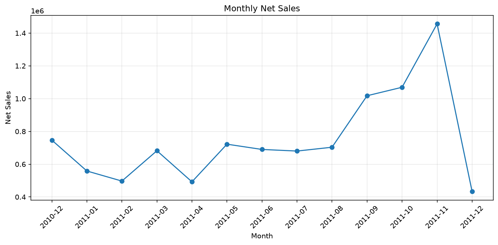
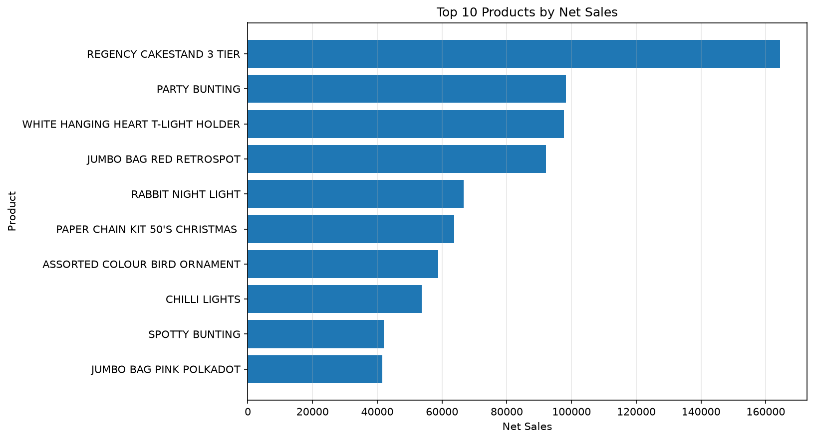
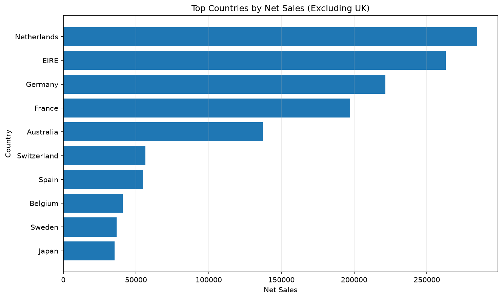

# 🛒 E-Commerce Sales Analysis

Exploratory analysis of **541,909 invoice lines** from a UK-based online retailer, using Python and Pandas to evaluate sales performance, cancellations and returns, product demand, country-level revenue, and customer behavior — with most of the effort spent on **data quality before trusting any aggregate**.


> **The #2 "best-seller" never actually sold.**
> Ranked by gross sales, one product came in second — 80,995 units, £168K. The raw rows showed the entire quantity was cancelled 12 minutes later under a linked invoice. Net contribution: zero. Gross figures alone would have put it in a sales report.

---

## 📌 Key Findings

| Metric | Value |
|---|---|
| Gross sales | **~£10.64M** |
| Net sales | **~£9.75M** |
| Lost to cancellations & returns | **~£894K (8.4%)** |
| Strongest complete month | **November 2011** (~£1.46M net) |
| UK share of net sales | **~84%** — the Netherlands is the top non-UK market |
| Top product by net sales | `REGENCY CAKESTAND 3 TIER` (~£164K) |

- **December isn't a decline.** The dataset ends on December 9, 2011, so the last month is incomplete.
- **"Best customer" depends on the question.** The customer with the highest total net sales (~£279K) ranks only 5th by average order value; the top customer by average order value (~£5.9K per order, min. 5 orders) spends less than half as much in total.

---

## ❓ Business Questions

- What are the gross and net sales?
- How much revenue is lost to cancellations and returns?
- Which months and countries generate the most revenue?
- Which products generate the highest net sales?
- Who are the most valuable customers — by total spend and by average order value?

---

## 🗂️ Dataset

**UCI Online Retail Dataset** — [Kaggle / UCI ML Repository](https://www.kaggle.com/datasets/jihyeseo/online-retail-data-set-from-uci-ml-repo/data)
**Records:** 541,909 · **Period:** December 2010 – December 2011 · **Currency:** GBP (£)

Each row is a single product line within an invoice, so one invoice can span multiple rows. Columns: invoice number, product code, description, quantity, invoice date, unit price, customer ID, and country.

> The raw dataset (~44 MB) is not included in this repo. See [How to Run](#-how-to-run) to reproduce the analysis.

---

## 🔍 Approach

1. **Initial inspection** — structure, dtypes, missing values
2. **Data quality assessment**
   - Missing values: `Description` (0.27%), `CustomerID` (24.93%)
   - Exact duplicates: 5,268 redundant rows removed
   - Numerical anomalies: negative quantities (cancellations/returns vs. inventory adjustments), zero prices (2,515 rows), and two negative-price "Adjust bad debt" entries
3. **Cleaning decisions**
   - Removed exact duplicates
   - Kept rows with a missing `CustomerID` for overall, product, and country analysis, and excluded them only from customer-level analysis
   - Investigated missing descriptions instead of dropping them blindly
   - Excluded non-product stock codes (postage, manual adjustments) from product rankings
4. **Gross vs. net as separate datasets** — each needs different filtering logic: gross keeps positive transactions only; net keeps cancellations to reflect the real revenue impact
5. **Analysis** — monthly trend, country breakdown, product performance, customer value (total spend vs. average order value)
6. **Visualization and export** — charts and result tables saved for reuse

---

## 📊 Visualizations







---

## 🚀 How to Run

```bash
git clone https://github.com/peteratef-eng/ecommerce-sales-analysis.git
cd ecommerce-sales-analysis
pip install pandas numpy matplotlib jupyter
```

1. Download the dataset from the [source link](https://www.kaggle.com/datasets/jihyeseo/online-retail-data-set-from-uci-ml-repo/data) and save it as `data.csv` in the project root.
2. Run the notebook:

```bash
jupyter notebook ecommerce_analysis.ipynb
```

The notebook reads the file with `encoding='ISO-8859-1'` (the source file is not UTF-8).

**Outputs:**
- Charts: `monthly_sales_trend.png`, `top_products.png`, `country_sales.png`, `top_customers_net_sales.png`, `top_customers_avg_order.png`
- Tables: `monthly_net_sales.csv`, `country_net_sales.csv`, `net_product_sales.csv`, `customer_summary.csv`, `top_average_order_customers.csv`

---

## 💡 What This Project Reinforced

Most of the effort went into the data-quality layer, not the charts — deciding what to keep, what to exclude, and why, before trusting any aggregate number.

## ➡️ What Came Next

I took that same discipline — systematic quality checks before transformation — into data engineering, where the checks run automatically on every load:
**[Weather Forecast Data Platform](https://github.com/peteratef-eng/weather-forecast-data-platform)** — a daily ELT pipeline with Python, PostgreSQL, dbt, and Airflow, deployed on AWS.

---

## 👤 Author

**Peter Atef** — Junior Data Engineer
[GitHub](https://github.com/peteratef-eng) · [LinkedIn](https://www.linkedin.com/in/peter-atef-eng) · [Portfolio](https://peter-atef-eng.streamlit.app)
